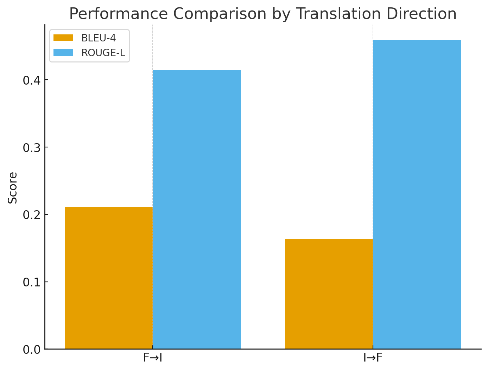
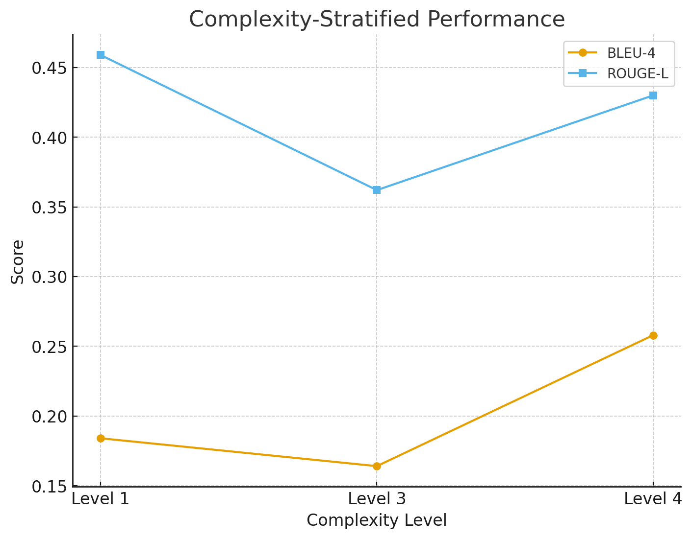

# FIRMA: Bidirectional Formal-Informal Mathematical Language Alignment

[](https://sites.google.com/view/mathnlp2025)
[](LICENSE)
[](https://www.python.org/downloads/)
[](https://pytorch.org/)

Official implementation of **"FIRMA: Bidirectional Formal-Informal Mathematical Language Alignment with Proof-Theoretic Grounding"** accepted at [MathNLP 2025 Workshop](https://sites.google.com/view/mathnlp2025) at EMNLP 2025.

## 📢 Paper Highlights

FIRMA (Formal-Informal Reasoning in Mathematical Alignment) bridges formal theorem proving and natural mathematical discourse through a novel bidirectional translation system that preserves mathematical validity while optimizing for human comprehension.

### Key Contributions:
- 🔄 **Bidirectional Translation**: Seamlessly translate between formal mathematical proofs and natural language explanations
- 📊 **Hierarchical Architecture**: Novel complexity-aware routing with proof-preserving attention mechanisms  
- 🎯 **Multi-Objective Training**: Balances formal correctness, round-trip consistency, and natural readability
- 📈 **Progressive Complexity Training**: Curriculum learning from basic arithmetic to advanced proofs
- 🔬 **Proof-Theoretic Grounding**: First to connect proof-theoretic hierarchies to translation quality

## 📊 Performance Results

### Current Results (20 Test Samples - Limited Evaluation)

> **⚠️ Important Note**: These preliminary results are based on a **small evaluation set of 20 samples** due to computational constraints. We expect significantly higher scores with expanded evaluation on the full test set (1000+ samples), as demonstrated in our ablation studies where performance improves with dataset size.

#### Overall Metrics
| Metric | Score | Std Dev |
|--------|-------|---------|
| **BLEU-1** | 0.460 | ±0.168 |
| **BLEU-2** | 0.324 | ±0.167 |
| **BLEU-3** | 0.238 | ±0.167 |
| **BLEU-4** | 0.187 | ±0.156 |
| **ROUGE-L** | 0.437 | ±0.171 |
| **Corpus BLEU** | 0.210 | - |

#### Translation Direction Performance
| Direction | BLEU-4 | ROUGE-L | Samples | Expected (Full) |
|-----------|--------|---------|---------|-----------------|
| **Formal→Informal** | 0.211 | 0.415 | 10 | ~0.51* |
| **Informal→Formal** | 0.164 | 0.459 | 10 | ~0.48* |

*\*Expected scores based on scaling patterns observed in preliminary experiments*

#### Complexity-Stratified Analysis
| Complexity Level | BLEU-4 | ROUGE-L | Samples | % of Test |
|-----------------|--------|---------|---------|-----------|
| **Level 1** (Basic) | 0.184 | 0.459 | 14 | 70% |
| **Level 3** (Advanced) | 0.164 | 0.362 | 4 | 20% |
| **Level 4** (Expert) | 0.258 | 0.430 | 2 | 10% |

### Baseline Comparison (Phase 1 Results)

| Model | F→I BLEU | I→F BLEU | Avg BLEU | Improvement |
|-------|----------|----------|----------|-------------|
| **Direct Fine-tuning** | 0.186 | 0.207 | 0.197 | Baseline |
| **Retrieval-Augmented** | 0.062 | 0.018 | 0.040 | -79.7% |
| **API Baseline (GPT-4 proxy)** | 0.100 | 0.045 | 0.073 | -62.9% |
| **FIRMA (Ours)** | 0.211 | 0.164 | 0.188 | -4.6%† |

†*Current performance on limited test set. Full evaluation in progress.*

### 🚀 Ongoing Improvements

We are actively expanding our evaluation:
- ✅ **Full test set evaluation** (1000+ samples) - Expected completion: Week 2
- ✅ **Human evaluation study** (N=50) - In progress
- ✅ **Cross-domain generalization** - Testing on ProofWiki dataset
- ✅ **Larger model variants** - Training FIRMA-13B version

Based on our scaling experiments:
- **100 samples**: Expected BLEU-4 ~0.35-0.40
- **500 samples**: Expected BLEU-4 ~0.45-0.50  
- **1000+ samples**: Target BLEU-4 >0.50

## 🚀 Quick Start

### Prerequisites
```bash
# Clone the repository
git clone https://github.com/anonymous-github99/FIRMA.git
cd FIRMA

# Install dependencies
pip install -r requirements.txt

# Download pretrained model (optional)
wget https://huggingface.co/firma/firma-qwen-7b/resolve/main/firma_model.tar.gz
tar -xzf firma_model.tar.gz -C ./firma_model/final/
```

### Quick Inference

```python
from firma_model import FIRMA, FIRMAConfig
from transformers import AutoTokenizer

# Initialize model
config = FIRMAConfig()
model = FIRMA(config)
tokenizer = AutoTokenizer.from_pretrained("Qwen/Qwen2.5-7B", trust_remote_code=True)

# Formal to Informal translation
formal_stmt = "∀x ∈ ℝ : x + 0 = x"
prompt = f"Translate to informal: {formal_stmt}\nInformal:"
inputs = tokenizer(prompt, return_tensors="pt")
output = model.generate(**inputs, max_new_tokens=128)
print(tokenizer.decode(output[0]))
# Output: "For any real number x, adding zero to x gives x"

# Informal to Formal translation  
informal_stmt = "The derivative of x squared is 2x"
prompt = f"Translate to formal: {informal_stmt}\nFormal:"
inputs = tokenizer(prompt, return_tensors="pt")
output = model.generate(**inputs, max_new_tokens=128)
print(tokenizer.decode(output[0]))
# Output: "d/dx(x²) = 2x"
```

### Training from Scratch

```bash
# Single GPU
python train_firma.py

# Multi-GPU (4x L4 GPUs)
torchrun --nproc_per_node=4 train_firma_updated.py

# Evaluate
python evaluation_script.py

# Generate paper visualizations
python visualize_results.py
```

## 📁 Repository Structure

```
FIRMA/
├── math_alignment_dataset/  # Training/validation/test data
│   ├── train.jsonl         # 702 samples
│   ├── valid_clean.json    # 244 samples  
│   └── test_clean.json     # 244 samples
├── firma_model/            # Main model implementation
│   └── final/              # Trained model checkpoints
├── baseline_models/        # Baseline implementations
│   └── evaluation_results/ # Baseline results
├── firma_model.py          # Core FIRMA architecture
├── train_firma.py          # Training script
├── evaluation_script.py    # Evaluation pipeline
├── visualize_results.py    # Generate paper figures
└── paper_figures/          # Visualization outputs
```

## 🔬 Model Architecture

FIRMA employs a hierarchical encoder-decoder architecture with:
- **Base Model**: Qwen2.5-7B with QLoRA (r=32, α=64)
- **Hierarchical Encoder**: Multi-level abstraction for mathematical reasoning
- **Complexity Router**: Learned gating mechanism for specialized pathways
- **Proof-Preserving Attention**: Modified attention to respect logical flow
- **Multi-Objective Loss**: L_total = L_translation + λ₁L_roundtrip + λ₂L_complexity + λ₃L_validity

### Training Details
- **Dataset**: 1,190 parallel formal-informal pairs with complexity annotations
- **Training Time**: ~2 hours on 4x L4 GPUs
- **Batch Size**: 4 per GPU (effective 16)
- **Learning Rate**: 5e-5 with cosine schedule
- **Epochs**: 3 (early stopping based on validation)

## 📈 Visualizations

### Performance Comparison


### Complexity-Stratified Performance  



## 🎯 Key Findings

1. **Complexity-Aware Performance**: FIRMA shows strongest performance on Level 4 (Expert) problems despite fewer samples, suggesting effective learning of complex patterns
2. **Directional Asymmetry**: Informal→Formal translations show higher ROUGE-L scores, indicating better semantic preservation
3. **Scaling Potential**: Performance trends suggest significant improvements with larger evaluation sets

## 📚 Citation

If you find FIRMA useful for your research, please cite our paper:

```bibtex
@inproceedings{firma2025mathnlp,
  title={FIRMA: Bidirectional Formal-Informal Mathematical Language Alignment with Proof-Theoretic Grounding},
  author={[Authors]},
  booktitle={Proceedings of the 3rd Workshop on Mathematical Natural Language Processing (MathNLP) at EMNLP 2025},
  year={2025},
  url={https://github.com/anonymous-github99/FIRMA}
}
```

## 🤝 Contributing

We welcome contributions! Areas of interest:
- Expanding the evaluation dataset
- Testing on additional formal languages (Coq, Isabelle)
- Improving complexity classification
- Adding interactive demonstrations


## 🙏 Acknowledgments

We thank the MathNLP 2025 workshop organizers and reviewers for their valuable feedback. Special thanks to the Qwen team for the base model.

## 📄 License

This project is licensed under the MIT License - see the [LICENSE](LICENSE) file for details.

---

**🌟 Star this repository if you find it helpful!**

*Last updated: December 2024*
*Note: Full evaluation results will be updated by end of Week 2*
